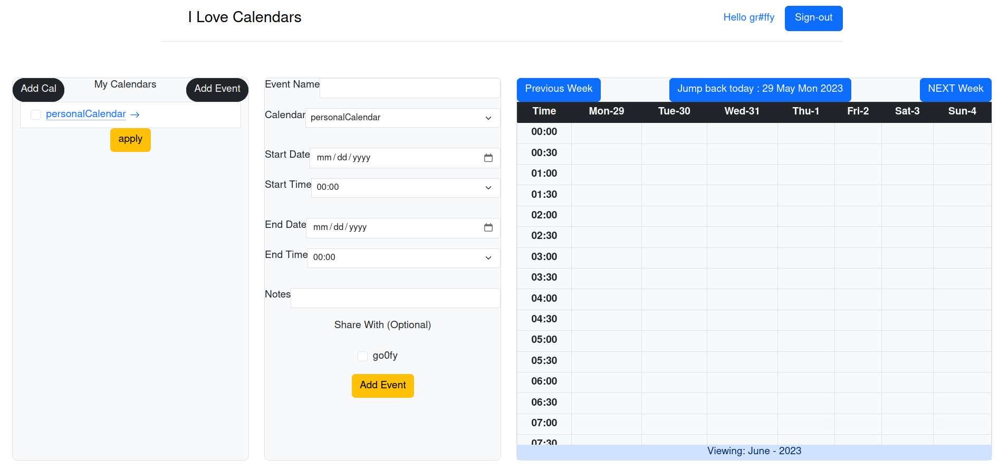

# About
 A Calendar application that will be capable of storing events for a user on any given day.  
It is also possible to share events with other users. Nosql used for this application is Google Cloud Platform datastore.
  
# How To run
 To run the server you first need to create Google Cloud Platform account and save your identification    
into enviornment variable of your shell and install packages listed in requirements.txt and finally run the server:  
    
```    
python main.py
```  
    
# Sample Front Page     


